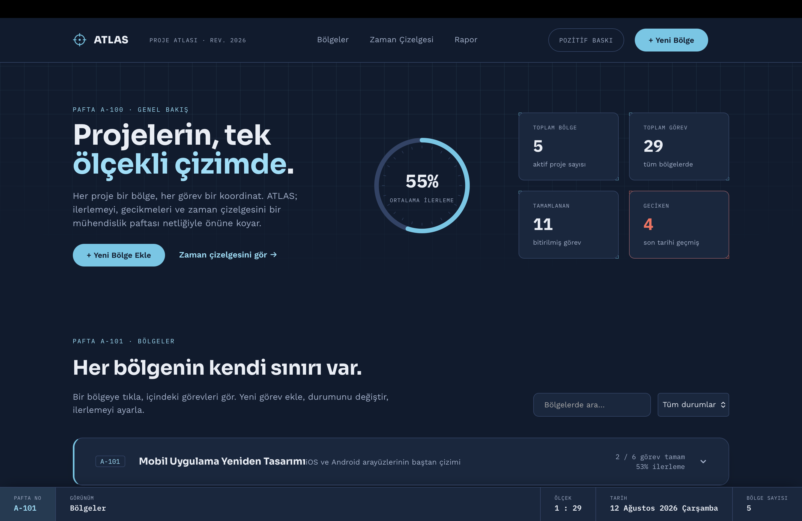
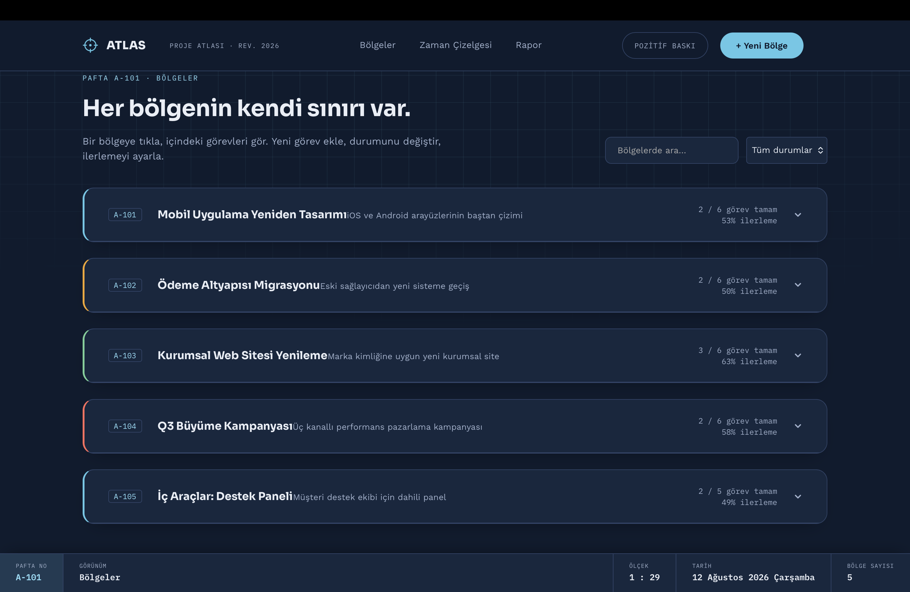
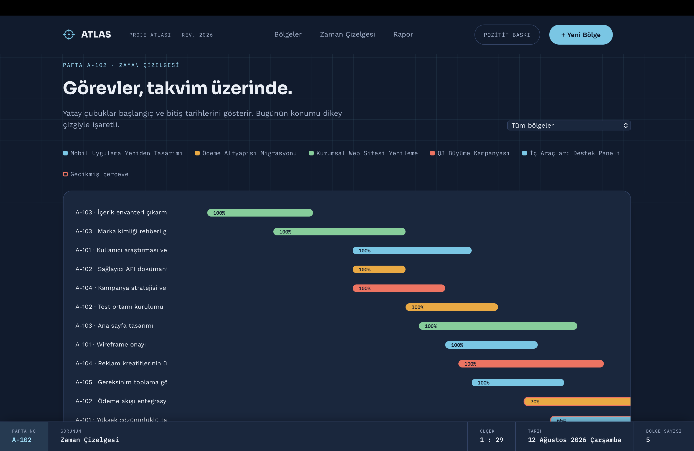
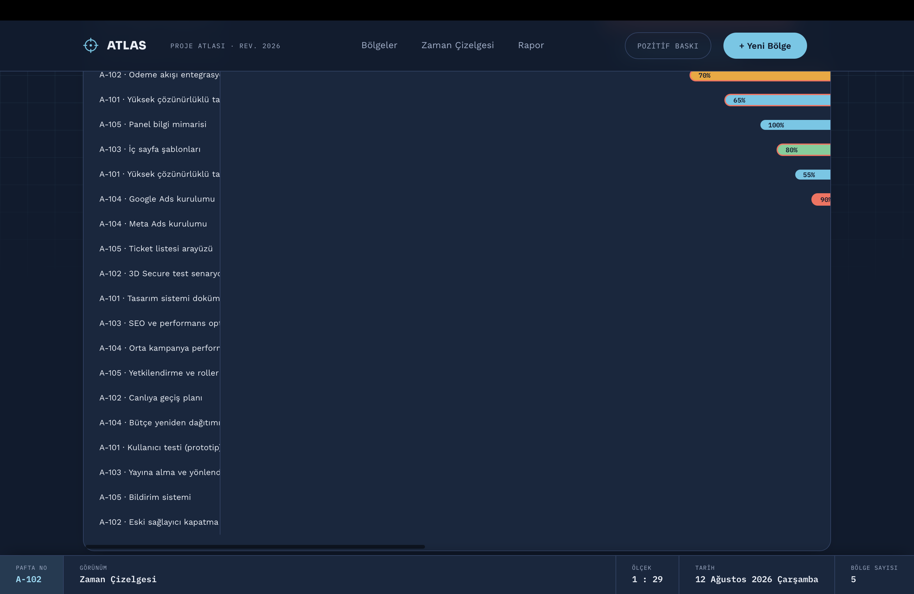
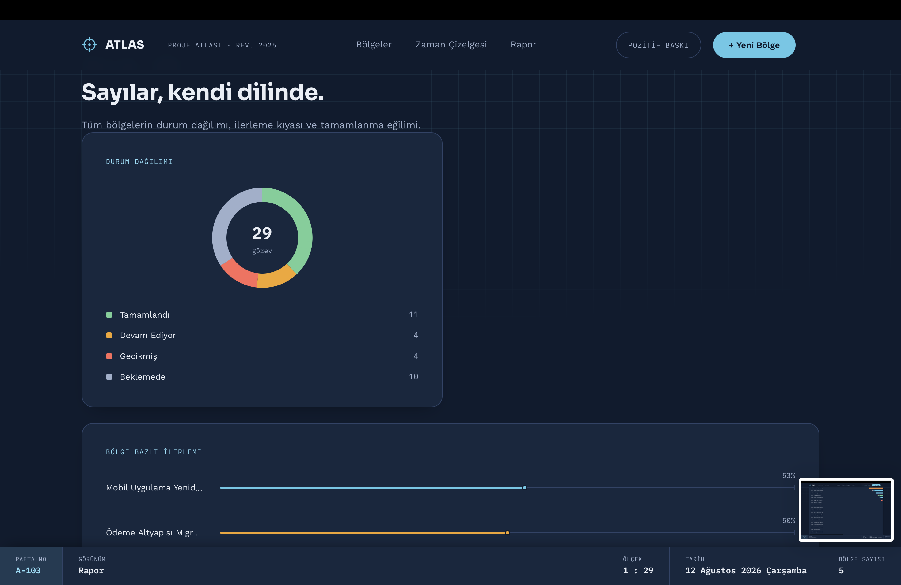
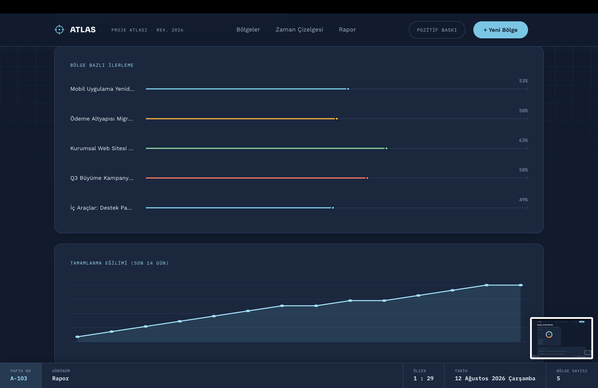

# 🗺️ Proje Yönetim Dashboard'u (ATLAS — Proje Atlası)

<div align="center">

  
  
  [](https://developer.mozilla.org/en-US/docs/Web/HTML)
  [](https://developer.mozilla.org/en-US/docs/Web/CSS)
  [](https://developer.mozilla.org/en-US/docs/Web/JavaScript)

  <p align="center">
    Mühendislik paftası ve teknik çizim hassasiyetiyle tasarlanmış; ilişkisel veri modeli, Gantt benzeri zaman çizelgesi, pusula ilerleme göstergesi ve canlı mimari pafta bloğu sunan gelişmiş proje takip dashboard'u.
  </p>

  <!-- Ekran Çıktıları -->
  <div align="center">
    
    <br>
    
    <br>
    
    <br>
    
    <br>
    
    <br>
    
  </div>

</div>

---

## 🌟 Öne Çıkan Özellikler

- **📐 Mimari Pafta Estetiği:** Teknik dökümantasyon konseptli grid arka planı, boyut çizgili (Dimension-line) ilerleme çubukları ve canlı Pafta No / Ölçek bilgilendirme bloğu (Title Block).
- **🔗 İlişkisel Veri Modeli:** Bölge (Proje) ve Görevler arasında bire-çok (1:N) ilişkisel ilişki yönetimi ve kaskad silme mimarisi.
- **📅 Gantt Zaman Çizelgesi:** Başlangıç ve bitiş tarihlerini dinamik yatay çubuklarla haritalandıran, bugünün çizgisini işaretleyen zaman çizgisi paneli.
- **📊 Saf SVG Raporlama:** Dış kütüphane kullanmadan tamamen elle çizdirilen 14 günlük eğilim çizgisi, donut durum grafiği ve pusula (Compass Gauge) göstergesi.
- **🖨️ Pozitif / Negatif Baskı Modu:** Klasik blueprint mavisi ve ters tonlu teknik pafta renk paletleri arasında geçiş imkanı.
- **🔍 Gelişmiş Arama ve Filtreleme:** Proje adı, görev metni ve proje durumuna göre anlık arama motoru.
- **⌨️ Hızlı Kısayollar:** `N` ile hızlı bölge oluşturma, `/` ile aramaya odaklanma ve `Esc` ile modalları kapatma.

---

## 🛠️ Kurulum ve Çalıştırma

Projeyi yerel makinenizde çalıştırmak için depoyu klonlayıp `index.html` dosyasını tarayıcınızda açmanız yeterlidir:

```bash
git clone [https://github.com/westblood585-sketch/proje-yonetim-dashboardu.git](https://github.com/westblood585-sketch/proje-yonetim-dashboardu.git)
cd proje-yonetim-dashboardu